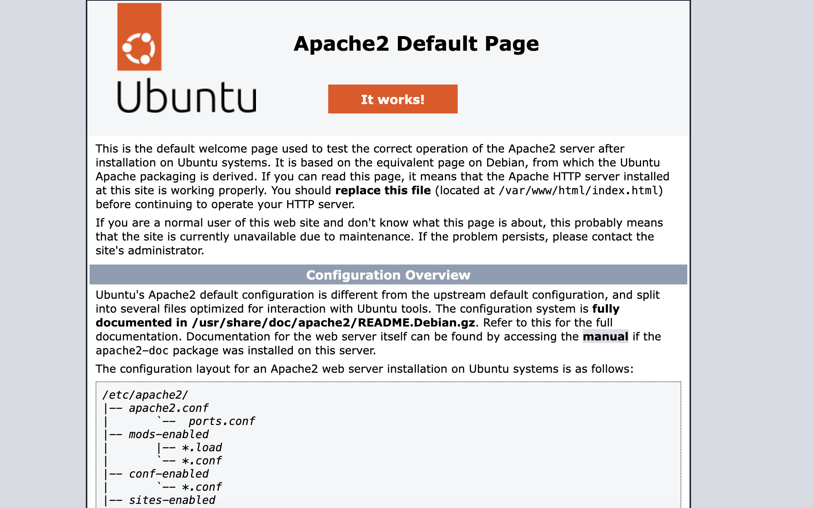
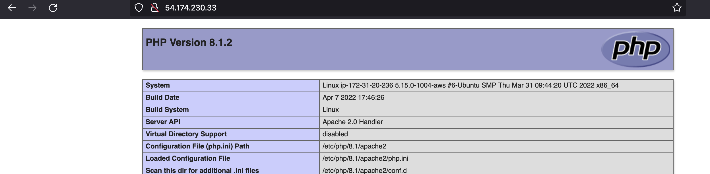
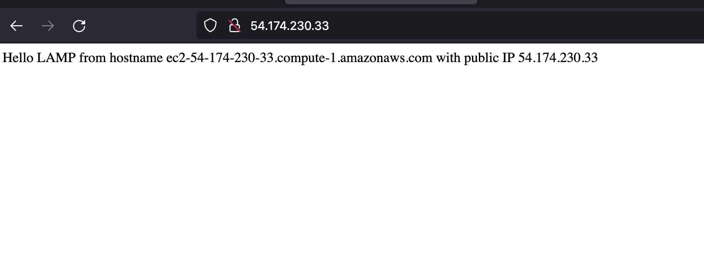

# LAMP stack implementation
## Installing Apache
Update a list of packages in package manager.
```
sudo apt update
```
Run apache2 package installation.
```
sudo apt install apache2
```
Verify that apache2 is running as a service.
```
sudo systemctl status apache2
```
```
curl http://localhost:80
# or head to http://<Public-IP-Address>:80
```



## Installing MySQL
```
sudo apt install mysql-server -y
sudo mysql_secure_installation
```
Verify installation.
```
sudo mysql
> exit;
```

## Installing PHP
```
sudo apt install php libapache2-mod-php php-mysql
```
Verify installation.
```
php -v
```



## Creating a virtual host for your website using Apache

```
sudo mkdir /var/www/projectlamp
sudo chown -R $USER:$USER /var/www/projectlamp
sudo vi /etc/apache2/sites-available/projectlamp.conf
# paste code from projectlamp.conf
```
```
sudo ls /etc/apache2/sites-available
```
Above will return:
```
000-default.conf  default-ssl.conf  projectlamp.conf
```

<br/>

```
sudo a2ensite projectlamp
sudo a2dissite 000-default
sudo apache2ctl configtest
sudo systemctl reload apache2
```
```
sudo echo 'Hello LAMP from hostname' $(curl -s http://169.254.169.254/latest/meta-data/public-hostname) 'with public IP' $(curl -s http://169.254.169.254/latest/meta-data/public-ipv4) > /var/www/projectlamp/index.html
```
Then head to `http://<Public-IP-Address>:80` to check results.

