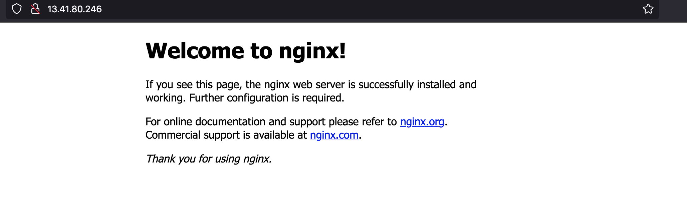
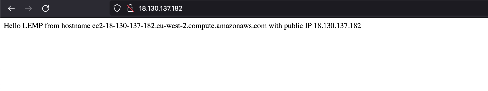
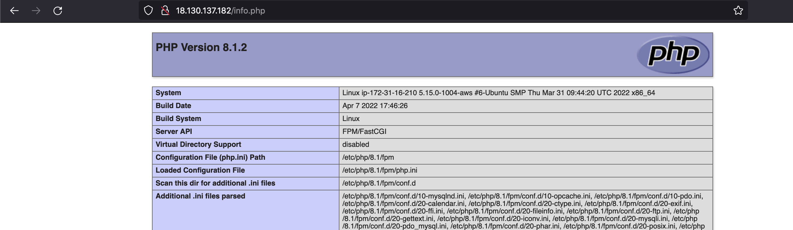
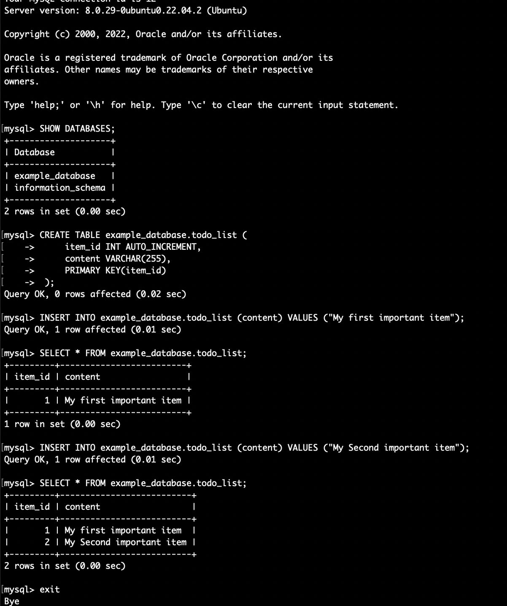
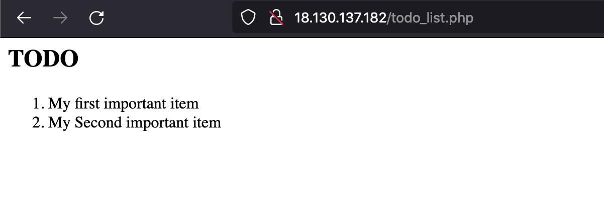

# LEMP stack implementation

## Installing nginx
```
sudo apt update
sudo apt install nginx
sudo systemctl status nginx
```
Head to `http://<Public-IP-Address>:80`.


## Installing MySQL
```
sudo apt install mysql-server
sudo mysql_secure_installation
```
```
sudo mysql
> exit;
```

## Installing PHP

```
sudo apt install php-fpm php-mysql
```

## Configuring NGINX to use PHP processor

```
sudo mkdir /var/www/projectLEMP
sudo chown -R $USER:$USER /var/www/projectLEMP
sudo vi /etc/nginx/sites-available/projectLEMP
# paste the code in projectLEMP file

sudo ln -s /etc/nginx/sites-available/projectLEMP /etc/nginx/sites-enabled/
sudo nginx -t
sudo unlink /etc/nginx/sites-enabled/default
sudo systemctl reload nginx

sudo echo 'Hello LEMP from hostname' $(curl -s http://169.254.169.254/latest/meta-data/public-hostname) 'with public IP' $(curl -s http://169.254.169.254/latest/meta-data/public-ipv4) > /var/www/projectLEMP/index.html
```
Head to `http://<Public-IP-Address>:80`.


## Testing PHP with NGINX
```
sudo nano /var/www/projectLEMP/info.php
# paste code from info.php
```
Head to `http://<Public-IP-Addres>/info.php`


## Retrieving data from MySQL database with PHP
```
sudo mysql
> CREATE DATABASE `example_database`;
> CREATE USER 'example_user'@'%' IDENTIFIED WITH mysql_native_password BY 'password';
> GRANT ALL ON example_database.* TO 'example_user'@'%';
> FLUSH PRIVILEGES;
> exit;
```

```
mysql -u example_user -p
> SHOW DATABASES;
> CREATE TABLE example_database.todo_list ( item_id INT AUTO_INCREMENT, content VARCHAR(255), PRIMARY KEY(item_id));
> INSERT INTO example_database.todo_list (content) VALUES ("My first important item");
> SELECT * FROM example_database.todo_list;
> exit;
```


```
nano /var/www/projectLEMP/todo_list.php
# paste code from todo_list.php
```
Check on `http://<Public_domain_or_IP>/todo_list.php`.


