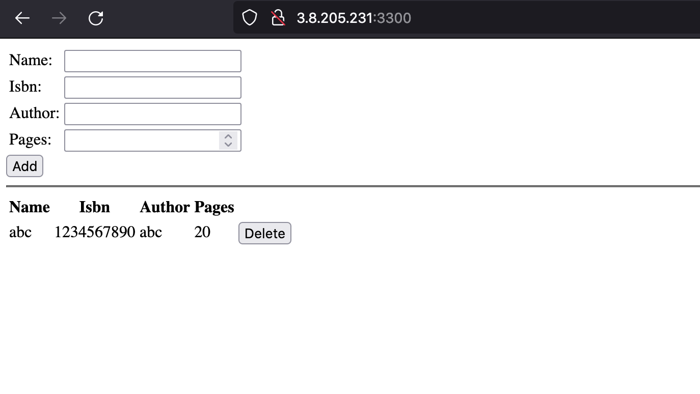

# MEAN stack deployment to Ubuntu in AWS

## Step 1: Install NodeJS
1. Reload and upgrade local package database.
    ```
    sudo apt update && sudo apt upgrade -y
    ```
2. Add certs.
    ```
    sudo apt -y install curl dirmngr apt-transport-https lsb-release ca-certificates
    ```
3. Install NodeJS and npm.
    ```
    curl -sL https://deb.nodesource.com/setup_14.x | sudo -E bash -
    sudo apt install -y nodejs
    ```
4. Check installation.
    ```
    node -v
    npm -v
    ```

## Step 2: Install MongoDB
1. Import the public key used by the package management system.
    ```
    wget -qO - https://www.mongodb.org/static/pgp/server-5.0.asc | sudo apt-key add -
    ```
2. Create a list file for MongoDB.
    ```
    echo "deb [ arch=amd64,arm64 ] https://repo.mongodb.org/apt/ubuntu focal/mongodb-org/5.0 multiverse" | sudo tee /etc/apt/sources.list.d/mongodb-org-5.0.list
    ```
3. Reload local package database.
    ```
    sudo apt-get update
    ```
4. If needed: Install libssl1.1
    ```
    echo "deb http://security.ubuntu.com/ubuntu impish-security main" | sudo tee /etc/apt/sources.list.d/impish-security.list
    sudo apt-get update
    sudo apt-get install libssl1.1
    ```
5. Install the MongoDB packages.
    ```
    sudo apt-get install -y mongodb-org
    ```
6. Start MongoDB.
    ```
    sudo systemctl start mongod
    ```
    You may need to reload the demon if you get `Failed to start mongod.service: Unit mongod.service not found.`
    ```
    sudo systemctl daemon-reload
    ```
7. Verify that MongoDB has started successfully.
    ```
    sudo systemctl status mongod
    ```
    You can optionally ensure that MongoDB will start following a system reboot by issuing the following command:
    ```
    sudo systemctl enable mongod
    ```
## Step 3: Install Express and access the routes with AngularJS
1. Install body parser.
    ```
    sudo npm install body-parser
    ```
2. Copy JS code and npm init
    ```
    svn export <TBA>
    cd Books
    npm init
    ```
3. Install express.
    ```
    sudo npm install express mongoose
    ```
4. Start the server.
    ```
    node server.js
    ```
    Head to the pubic ip on port 3300.
    