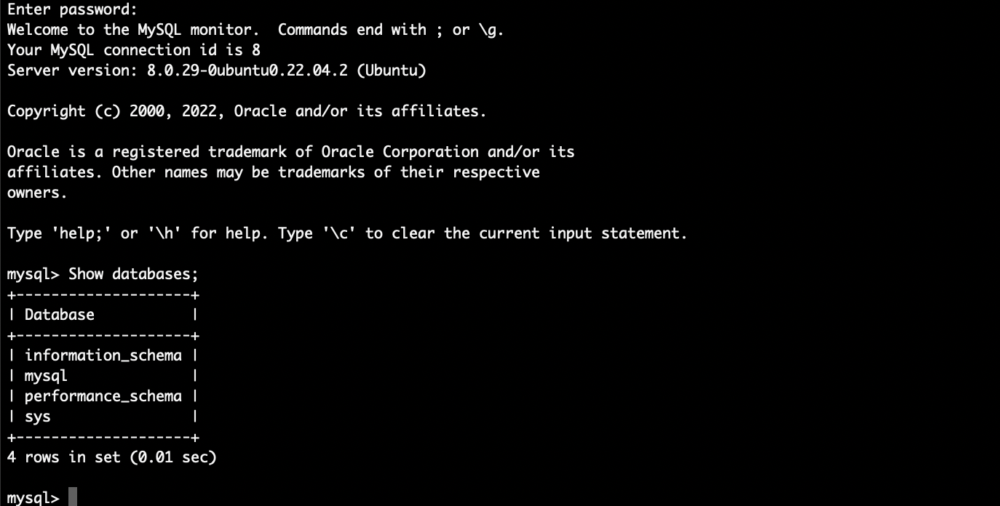

# Client-Server Architecture

1. Setup initial mysql-server instance.
    ```
    sudo apt update && sudo apt upgrade -y
    sudo apt install mysql-server -y
    sudo systemctl enable mysql
    ```

2. Setup mysql-client instance.
    ```
    sudo apt update && sudo apt upgrade -y
    sudo apt install mysql-client -y
    ```
    Add this ip to the mysql-server with subnet 32
    ```
    ip addr show
    # or use
    ip -o -4 addr show eth0 | sed -e 's/^.*inet \([^ ]\+\).*/\1/'
    ```
3. Allow mysql-server access from mysql-client.
    ```
    sudo vi /etc/mysql/mysql.conf.d/mysqld.cnf
    ```
    and change `bind-address = 127.0.0.1` to `bind-address = 0.0.0.0`

    Then restart service and enter mysql.
    ```
    sudo systemctl restart mysql 
    sudo mysql
    ```
    ```sql
    CREATE USER 'user'@'#' IDENTIFIED WITH mysql_native_password BY 'password';
    GRANT ALL ON *.* TO 'myuser'@'%';
    FLUSH PRIVILEGES;
    exit;
    ```
    ```
    sudo ufw allow from <client-IP-addr> to any port 3306
    # or from any IP
    sudo ufw allow 3306
    ```
4. Connect via mysql-client.
    ```
    mysql -u user -h <remote-IP-addr> -p
    ```
    

## Extras
Diagnostic command for displaying possible routes (paths) and measuring transit delays of packets across an Internet Protocol (IP) network.
```
traceroute -w 3 -q 1 -m 16 playvalorant.com
```

## Resources
- https://www.digitalocean.com/community/tutorials/how-to-allow-remote-access-to-mysql
- https://stackoverflow.com/questions/16287559/mysql-adding-user-for-remote-access